# NLP-to-SQL Query Engine

> A Streamlit web application that converts plain-English AP automation
> questions into correct SQLite SQL via a semantic layer and OpenAI gpt-4.1-mini.
> Everything is accessible through the browser UI — no CLI.

---

## Architecture




### Project layout

```
cashflo/
├── app.py                         ← Streamlit app (UI + orchestration)
├── semantic_layer.yaml            ← Business dictionary
├── cashflo_sample.db              ← SQLite database (12 tables, ~1 000 rows)
├── cashflo_sample_schema_and_data.sql
├── pyproject.toml                 ← uv project config
├── .env.example                   ← Copy to .env and fill in
├── .gitignore
├── Dockerfile
├── .streamlit/
│   └── config.toml
└── engine/                        ← Backend package
    ├── __init__.py                ← Re-exports all public classes
    ├── config.py                  ← Settings dataclass  (reads .env)
    ├── logger.py                  ← PipelineLogger + LogEntry + LogLevel
    ├── semantic_layer.py          ← SemanticLayer + TemporalResolver
    ├── query_executor.py          ← QueryExecutor + QueryResult
    ├── cache.py                   ← QueryCache + CacheEntry
    └── nlp_to_sql.py              ← NLPtoSQLEngine + ConversationSession + NLPQueryResult
```

---

## Quick start

### 1 – Prerequisites

| Tool | Version |
|---|---|
| Python | 3.10+ |
| [uv](https://docs.astral.sh/uv/getting-started/installation/) | any recent |
| OpenAI API key | [platform.openai.com/api-keys](https://platform.openai.com/api-keys) |

### 2 – Install

```bash
git clone <repo-url>
cd cashflo
uv sync          # creates .venv/ and installs all dependencies
```

### 3 – Configure

```bash
cp .env.example .env
# open .env and set OPENAI_API_KEY=sk-proj-...
# model is fixed to gpt-4.1-mini — no other config required
```

### 4 – Run

```bash
uv run streamlit run app.py
```

Open **http://localhost:8501** in your browser.

---

## Using the Streamlit app

### Connect
The app reads `OPENAI_API_KEY` from `.env` and connects automatically on startup.
No key entry or button click is needed — the sidebar shows the connection status.
If the key is missing or invalid, an error is shown with instructions to fix `.env`.

### Ask questions
Type in the chat box or click any **Sample Question** in the sidebar.
The engine generates SQL, executes it against the database, and returns:

| Panel | Contents |
|---|---|
| **KPI row** | Row count · Query time · Tokens used · Cache hit |
| **Generated SQL** | Expandable code block |
| **Results** | Interactive dataframe + CSV download button |
| **Auto-chart** | Plotly bar / line / pie / scatter chosen by data shape |
| **Explanation** | Plain-English summary of what the SQL does |
| **Pipeline Logs** | Step-by-step trace of the entire pipeline run |

### Multi-turn conversations
Follow-up questions remember context:
```
"What is the total outstanding amount?"
"Now break that down by vendor."
"Show the top 5 only."
```
Click **🔄 Reset Conversation** in the sidebar to start fresh.

### Pipeline Logs

Every query shows a collapsible **Pipeline Logs** panel with one row per event:

```
[10:23:41.012] ℹ️  [pipeline  ] Starting pipeline for: 'Who are our top 5 vendors?'
[10:23:41.013] ⚠️  [ambiguity ] Ambiguous question detected → Assuming 'top vendors' means highest total invoice value.
[10:23:41.014] ℹ️  [cache     ] Cache MISS – will call LLM.                            (1 ms)
[10:23:41.015] ℹ️  [llm       ] Calling OpenAI gpt-4o for SQL generation…
[10:23:43.201] ℹ️  [llm       ] SQL generated (1 842 tokens used).                     (2 186 ms)
[10:23:43.202] ✅  [validate  ] SQL syntax valid (EXPLAIN passed).                       (1 ms)
[10:23:43.203] ⚡  [execute   ] Execution succeeded: 5 row(s) in 2.4 ms.
[10:23:43.204] ℹ️  [explain   ] Generating plain-English explanation…
[10:23:44.109] ℹ️  [explain   ] Explanation ready (312 tokens).                         (905 ms)
[10:23:44.110] ℹ️  [cache     ] Result stored in cache.
[10:23:44.111] ℹ️  [pipeline  ] Pipeline complete. Total tokens: 2 154.
```

Switch **Log detail** in the sidebar to `DEBUG` to see the full generated SQL in the log.
Download the full log as a `.txt` file with the **⬇ Download full log** button.

### Cache management
- **Query Cache** toggle in the sidebar enables/disables caching.
- **Cached Queries / Hits** metrics update live.
- **🗑️ Clear Cache** deletes all cached entries.
- Fuzzy matching (TF-IDF cosine, threshold 0.85) reuses cached SQL for paraphrased questions.

---

## Docker

### Build

```bash
docker build -t cashflo-nlp .
```

### Run

```bash
docker run -p 8501:8501 --env-file .env cashflo-nlp
```

Open **http://localhost:8501**.

---

## Environment variables

| Variable | Default | Description |
|---|---|---|
| `OPENAI_API_KEY` | *(required)* | OpenAI secret key |
| `CASHFLO_DB` | `cashflo_sample.db` | Path to SQLite database |
| `CASHFLO_YAML` | `semantic_layer.yaml` | Path to semantic layer config |
| `CASHFLO_CACHE_DB` | `query_cache.db` | Path to query cache |
| `CASHFLO_MAX_RETRIES` | `1` | LLM self-correction retries |
| `CASHFLO_NO_CACHE` | `false` | Set `true` to disable cache |
| `STREAMLIT_SERVER_PORT` | `8501` | Streamlit server port |

> **Model** is fixed to `gpt-4.1-mini` in `engine/config.py` and is not configurable via environment variable.

---

## Semantic Layer (`semantic_layer.yaml`)

The YAML is the "business dictionary" – editable by domain experts without touching Python.

### Tables & Columns
Each table has `description`, `synonyms`, and per-column `type`/`desc`/`values`.

### Relationships
```yaml
relationships:
  direct:
    - { from: invoices, to: vendors,         join: "invoices.vendor_id = vendors.id" }
    - { from: invoices, to: purchase_orders, join: "invoices.po_id = purchase_orders.id" }
  multi_hop:
    - path: "invoices to departments"
      via:  "invoices.po_id = purchase_orders.id AND purchase_orders.department_id = departments.id"
```

### Business Metrics
```yaml
metrics:
  revenue:
    sql: "SUM(invoices.grand_total) FILTER (WHERE invoices.status = 'paid')"
    synonyms: [income, earnings, total_paid]
  outstanding:
    sql: "SUM(invoices.grand_total) FILTER (WHERE invoices.status IN ('approved','validated','on_hold'))"
    synonyms: [unpaid, pending_payment, due]
```

### Temporal expressions (resolved at query time)

| Phrase | Example resolved range (2026-03-27) |
|---|---|
| `this_quarter` | 2026-01-01 → 2026-03-27 |
| `last_quarter` | 2025-10-01 → 2025-12-31 |
| `this_month` | 2026-03-01 → 2026-03-27 |
| `last_month` | 2026-02-01 → 2026-02-28 |

---

## Engine class reference

| Class | Location | Responsibility |
|---|---|---|
| `Settings` | `engine/config.py` | Reads all config from `.env`; validates required fields |
| `TemporalResolver` | `engine/semantic_layer.py` | Converts time phrases to ISO date ranges |
| `SemanticLayer` | `engine/semantic_layer.py` | Loads YAML; builds LLM prompt context; detects ambiguity |
| `QueryResult` | `engine/query_executor.py` | Holds rows, columns, timing, error for one SQL execution |
| `QueryExecutor` | `engine/query_executor.py` | SQLite wrapper; EXPLAIN-based validation; read-only |
| `CacheEntry` | `engine/cache.py` | Single cached record |
| `QueryCache` | `engine/cache.py` | Persistent SQLite cache with TF-IDF fuzzy matching |
| `LogEntry` | `engine/logger.py` | One log event (timestamp, level, step, message) |
| `PipelineLogger` | `engine/logger.py` | Collects log entries during a pipeline run |
| `NLPQueryResult` | `engine/nlp_to_sql.py` | Full output of one pipeline run incl. log + token count |
| `NLPtoSQLEngine` | `engine/nlp_to_sql.py` | Orchestrates the 8-step pipeline; emits structured logs |
| `ConversationSession` | `engine/nlp_to_sql.py` | Multi-turn wrapper; maintains conversation history |

---

## Sample questions

| Category | Question |
|---|---|
| Simple | "How many invoices were raised last month?" |
| Simple | "List all vendors on the watchlist." |
| Join | "Show me all invoices for the Engineering department." |
| Join | "Which vendors have overdue invoices greater than INR 1,00,000?" |
| Aggregation | "What is the total outstanding amount across all vendors?" |
| Aggregation | "What was our revenue last quarter?" |
| Synonyms | "Show me all unpaid bills." |
| Window | "Rank vendors by total invoice value." |
| Window | "Show each invoice alongside the previous invoice amount for the same vendor." |
| Ambiguous | "Who are our top 5 vendors?" → assumption stated |
| Temporal | "Compare this quarter's invoice volume with last quarter." |

---

## Design decisions & trade-offs

**Streamlit-only** – No CLI.  All features (cache management, settings, logs, downloads) live in the browser UI.  This keeps the codebase simple and removes a separate entry-point surface.

**OpenAI gpt-4.1-mini** – Good balance of accuracy and cost for text-to-SQL.  Model is hardcoded in `engine/config.py`; change the `openai_model` default there if you need a different model.

**Structured pipeline logs** – Every step (ambiguity check, cache lookup, LLM call, SQL validation, execution, explanation) emits a `LogEntry` with timing.  Users see exactly what happened and can download the full trace.

**LLM calls per question:**
- Cache hit: **0 calls**
- Normal: **2 calls** (SQL + explanation, ~1 500–2 500 tokens total)
- Self-correction: **3 calls**

**What would break at scale:**
- SQLite cache → swap for PostgreSQL with pgvector for embedding-based similarity
- Full semantic context (~14 KB) sent every call → add retrieval to select only relevant tables
- Streamlit session state → replace with a proper backend API + auth layer

---

## AI Tools Used

### Claude Code (`claude-sonnet-4-6`)
All source code in this project was written with **Claude Code** as a terminal agent:
- Read and analysed the 12-table SQL schema
- Designed and wrote all `engine/` Python classes with full docstrings
- Built the Streamlit UI with chat interface, log rendering, auto-charts, and CSV download
- Debugged YAML parsing errors and Windows encoding issues
- Wrote this README

### OpenAI Codex / GitHub Copilot
Not used.
